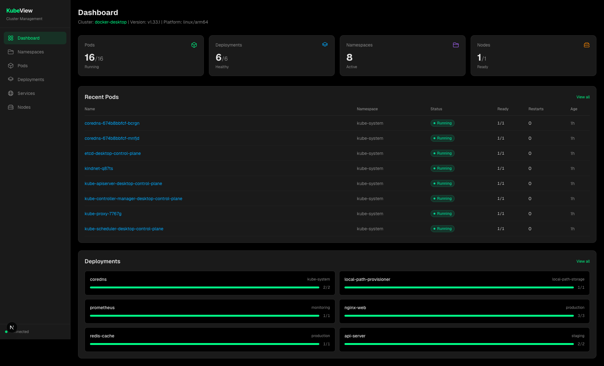
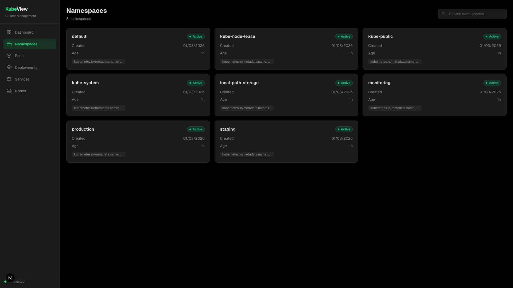
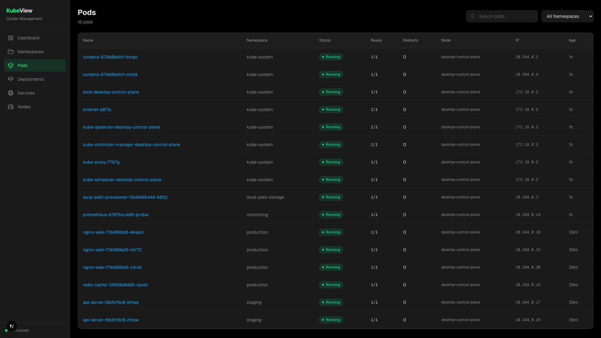
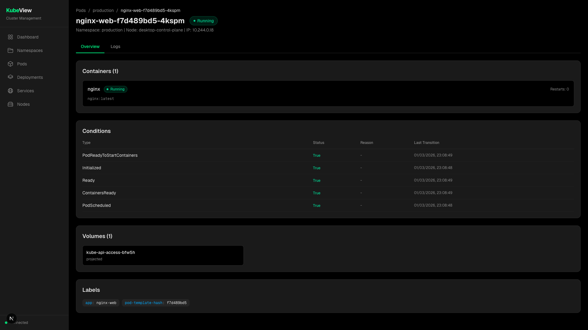
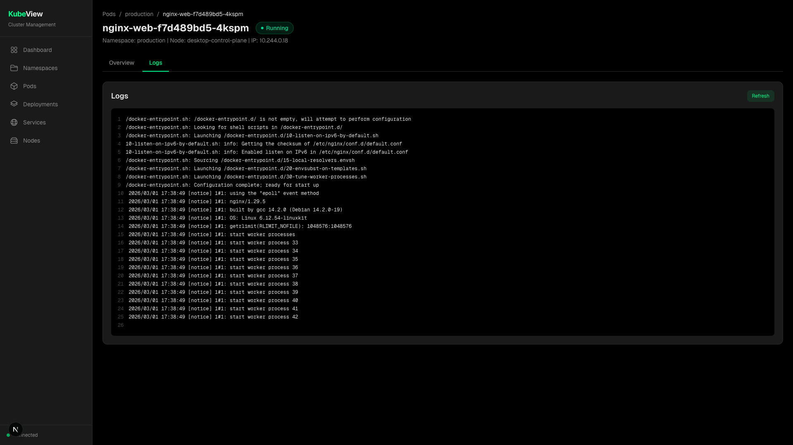
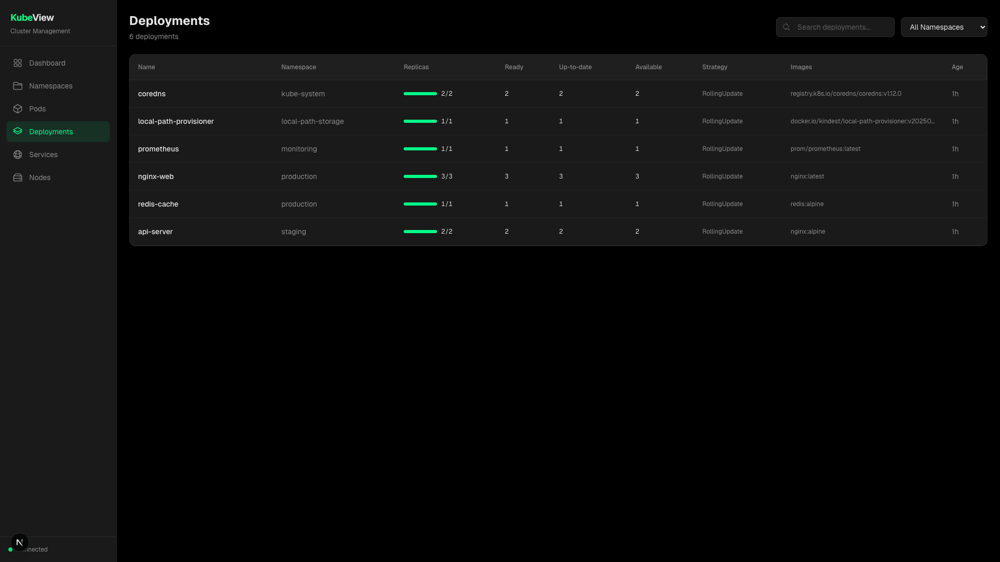
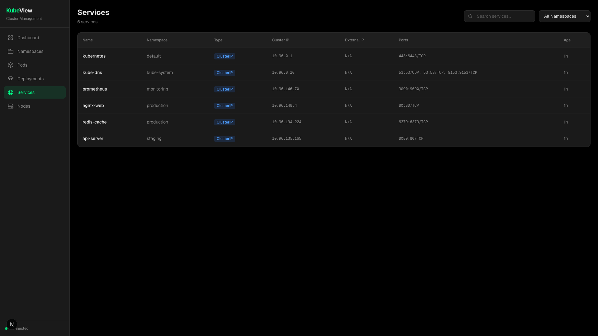
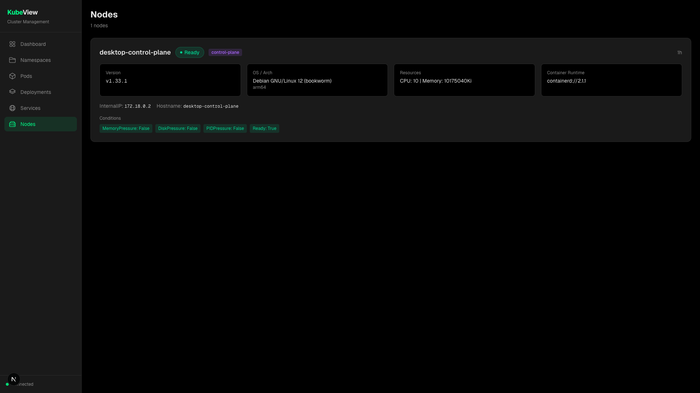

# KubeView

A lightweight web dashboard for monitoring a Kubernetes cluster. KubeView talks to your cluster through the standard kubeconfig and surfaces pods, deployments, services, nodes, namespaces, events, and pod logs in a clean, auto-refreshing UI — a browser-friendly companion to `kubectl get`.



## Features

- Cluster overview with live pod, deployment, and node health counts
- Namespace, pod, deployment, service, and node browsers with search and namespace filters
- Pod detail view with container info, conditions, volumes, and live log tail
- Auto-refresh every 5 seconds across every page
- Read-only by design — never mutates cluster state

## Architecture

KubeView is a two-part application:

- **`kubeview-backend/`** — Go API on port `5501`. Connects to your cluster using `k8s.io/client-go` (loads kubeconfig from the default location). Exposes a small REST API and reshapes raw Kubernetes objects into a frontend-friendly JSON shape.
- **`kubeview-frontend/`** — Next.js 16 + React 19 + Tailwind v4 app on port `5500`. Polls the backend every 5 seconds and renders the data.

```
Browser  ──▶  Frontend (Next.js, :5500)  ──▶  Backend (Go, :5501)  ──▶  Kubernetes API
```

## Prerequisites

- **Go 1.26+** (for the backend)
- **Node.js 18+** (for the frontend)
- **A running Kubernetes cluster** reachable from your kubeconfig — Docker Desktop's built-in Kubernetes, [kind](https://kind.sigs.k8s.io/), [minikube](https://minikube.sigs.k8s.io/), or any remote cluster all work.
- **kubectl** configured. Verify with:
  ```bash
  kubectl get nodes
  ```
  If that command succeeds, KubeView will be able to connect.

## Getting started

Clone the repo and start the two services in separate terminals.

**Terminal 1 — backend:**
```bash
cd kubeview-backend
go run .
```
The API is now running at http://localhost:5501. You can sanity-check it with `curl http://localhost:5501/api/health`.

**Terminal 2 — frontend:**
```bash
cd kubeview-frontend
npm install
npm run dev
```
The dashboard is now running at http://localhost:5500. Open it in your browser.

## Configuration

Both services default to localhost ports but can be configured for non-local deployments via environment variables:

| Variable | Service | Default | Purpose |
|----------|---------|---------|---------|
| `PORT` | backend | `5501` | Port the API listens on. |
| `CORS_ORIGIN` | backend | `http://localhost:5500` | Comma-separated list of allowed browser origins, e.g. `https://kubeview.example.com,http://localhost:5500`. |
| `KUBECONFIG` | backend | `~/.kube/config` | Path to the kubeconfig used to reach the cluster. |
| `NEXT_PUBLIC_API_BASE` | frontend | `http://localhost:5501/api` | Backend API base URL, inlined at build time (`npm run build`). |

Example:

```bash
# Backend on port 8080, accepting requests from a deployed frontend
PORT=8080 CORS_ORIGIN=https://kubeview.example.com go run .

# Frontend built against a deployed backend
NEXT_PUBLIC_API_BASE=https://api.kubeview.example.com/api npm run build
```

## API reference

The backend exposes the following endpoints. All responses are JSON.

| Method | Path | Description |
| --- | --- | --- |
| GET | `/api/health` | Health check |
| GET | `/api/cluster` | Cluster version, platform, node count, current context |
| GET | `/api/namespaces` | All namespaces |
| GET | `/api/pods?namespace=<ns>` | Pods (optionally filtered by namespace) |
| GET | `/api/pods/:namespace/:name` | Single pod detail |
| GET | `/api/pods/:namespace/:name/logs?container=<c>&tailLines=<n>` | Pod logs (defaults to last 100 lines) |
| GET | `/api/deployments?namespace=<ns>` | Deployments |
| GET | `/api/services?namespace=<ns>` | Services |
| GET | `/api/nodes` | Cluster nodes |
| GET | `/api/events?namespace=<ns>` | Recent cluster events |

## Screenshots

| | |
| --- | --- |
| **Namespaces**  | **Pods**  |
| **Pod detail**  | **Pod logs**  |
| **Deployments**  | **Services**  |
| **Nodes**  | |

## Tech stack

**Backend:** Go 1.26, standard-library `net/http` (`http.ServeMux`), [client-go](https://github.com/kubernetes/client-go) (`k8s.io/client-go`, `k8s.io/api`, `k8s.io/apimachinery`).

**Frontend:** Next.js 16 (App Router), React 19, TypeScript 5, Tailwind CSS v4, ESLint 9.

## Project structure

```
kubeview/
├── kubeview-backend/        # Go API (port 5501)
│   ├── main.go              # Server bootstrap, timeouts, graceful shutdown
│   ├── kube.go              # kubeconfig loading + client-go wrappers
│   ├── handlers.go          # HTTP handlers, router, CORS, error helpers
│   ├── transformers.go      # Reshape K8s objects into frontend JSON
│   ├── go.mod
│   └── go.sum
├── kubeview-frontend/       # Next.js dashboard (port 5500)
│   ├── src/
│   │   ├── app/             # App Router pages
│   │   ├── components/      # Sidebar, filters, badges, ...
│   │   └── lib/             # API client + polling hook
│   └── package.json
└── screenshots/             # Images used in this README
```

## Troubleshooting

- **`UnauthorizedError` or `ECONNREFUSED` when starting the backend** — your kubeconfig isn't pointing at a reachable cluster. Run `kubectl get nodes` first; if that fails, the backend will too.
- **The dashboard shows `Failed to fetch`** — make sure the backend is running on port `5501` and that nothing else is using that port.
- **Empty tables** — you may have an empty cluster. Try `kubectl run nginx --image=nginx` to create a pod, then refresh.
